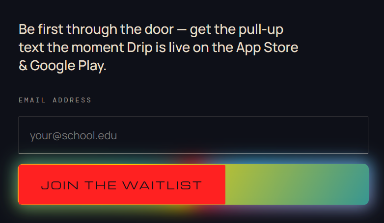
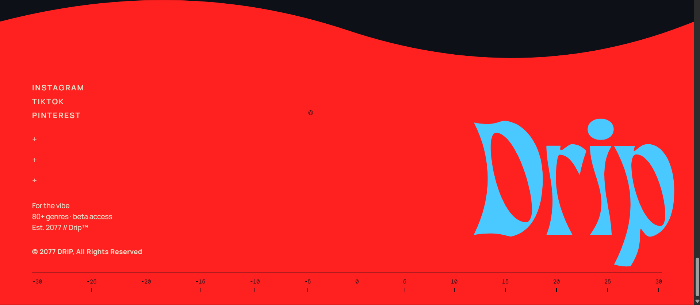

ok so am still not satisfied from the user flow of the site
let's make the user flow as smooth as the landonorris site, we already have its source code so get inspired from it. 

1. hero section --  this time let's implement, this a total different way, this time we'll have [text](hero.md), offcentered towards the right 
with Text written offcentered towards the left in "Alined left" format 
with the hero sections going through the letters of the words in the text

Text being: FASHION IS EVERYWHERE. TASTE ISN'T.

as the user scrolls down i don't want and immediant cut to the next frame, let's use fade out texts,pop out and popin of texts and color fade in/out to the, all 
card zoom outs etc. scroll-trigger based transition to the next frame (Take inspiration fromt he lando norris website for transition between frames in the landing page)

bg color fade to red #FF2020

2. Manifesto -- in this section 
first let's do the text in this section in #E8DFC8 and #000000 , black being used for one Word to make things highlight, 

bg color fades to #0E1018

use fream transition to the next section. with text such as "The fashion social network.

3. what are we -- here mostly its all good,
but here do mention in more bolder way of expression "We don't sell clothes. We sell dressing sense."

as we transition to the next frame 
make the grid cards pop up one at a time as the user scrolls down,
make it so that i can change all the images in the page later on btw.

4. Genres -- this section is good, we'll leave it be 

no Transition between these frames
rememebr too much transition is also bad for UX

5. wear the app --  this section is also good no changes here 

bg color fades to #E8DFC8

6. Questions. --  in this section when the user does clicks on different questions, i want the image to pop in with some animation and not just spawn there ,so that needs fixing 

bg colour fades to #000000 

7. waitlist -- This section is good, the join the waitlist button still needs fixing tho, when i hover my cursor on it in desktop, the effect which comes up takes up the ,  fix that accordingly.
also  in this element, make the size of both playstore and app store equal whjy is play store smaller here, fix that 

no transitions from waitlist to the footer 

8. footer -- 
in this section , remoce this thing which is just ther ein the middle for some reason, and 
the "Drip" text towards the right make thiat initially come up with #DED8CC 

-----
For Red in the entire site use these instead of the cherry one which we have, 
#A52700 
#EC5E27
 

